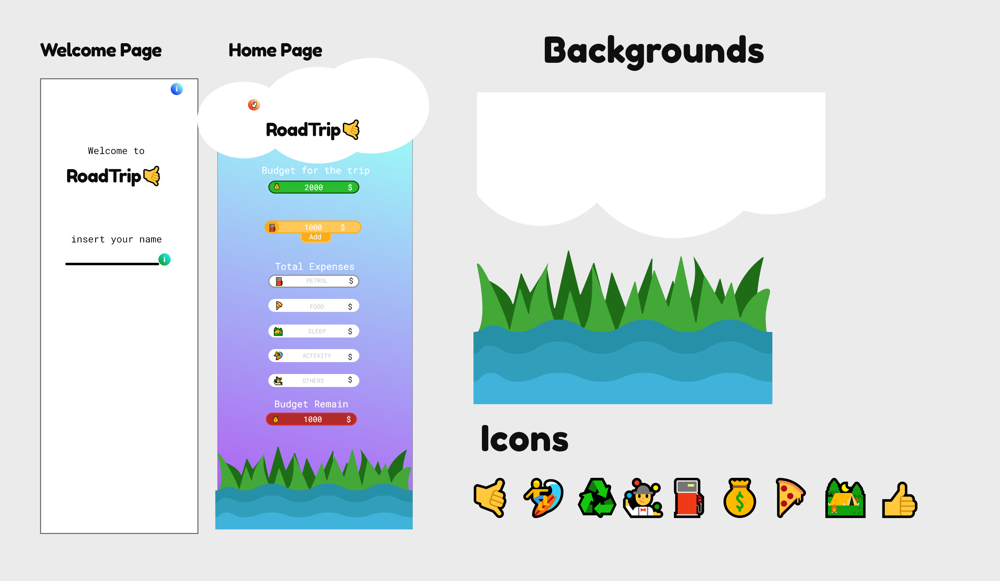

# RoadTrip (Beta)

Track your expenses during a trip

### The challenge

Users should be able to:

- Insert the budget for the trip.
- Adding different expenses, base on the category.
- Have an overview of the trip with the budget remain.

### Screenshot

### Links

- Live Site URL: [RoadTrip](https://onroadtrip.netlify.app/)

## My process

### Built with
- [LocalStorage]
- [React](https://reactjs.org/) - JS library
- [Typescript](https://www.typescriptlang.org/) 
- [Styled Components](https://styled-components.com/) - For styles
- [Framer-Motion](https://www.framer.com/motion/) - Animation
- [Use-Sound](https://github.com/joshwcomeau/use-sound#sprites) -Sound

### Continued development

I'll update RoadTrip adding:

- The possibility to insert city depart and city arrive, calculating the hypothetical distance. 
- Use of a database and sign up  instead of using  local storage.
- Possibility to share your trip.
- and more.

## Author

- Website - [Diego Massarini](https://diego-slicecode.dev/)
- Twitter - [slicecodediego](https://twitter.com/slicecodediego)

